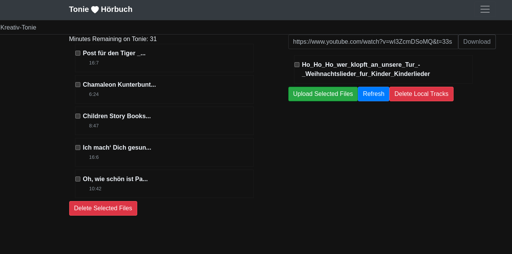

# tonie-audio-match

Your 1-click audio book upload to your [creative tonies](https://tonies.com).

## The Story

It's bedtime for one of your kids, they are tired (just like you), their patience is down to a minimum.
And now they want to hear their beloved audio book.
Which of course is not on one of their creative tonies anymore.
Darn.

So... you are going to pick up your laptop, open the tonies website, log in... all the way down to uploading your child's desired audio book the proper tonie.
That's cumbersome.

How about a simple UI which shows all your audio books where one click suffices to upload an audio book to a tonie?
Congratulations, search no more, you are right here, I got your back! :)

So yet another UI to access from your laptop? 
Not at all! 
Put it onto a RaspberryPi and voilà -- accessible from your mobile whenever you need it! 🙂

## Configuration & Start

Place an `.env` file in this project's root to configure your service (like credentials for [tonies.de](https://tonies.de)).
Please see [.env.sample](.env.sample) for a sample configuration.

Once configured, start the whole application with `docker-compose up` and, after some initial processing of your media library, access your album covers locally at [http://localhost](http://localhost).